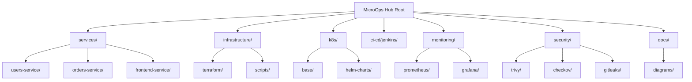

# MicroOps Hub 🚀

**MicroOps Hub** is a fully open-source, end-to-end DevOps showcase built around **Java (Spring Boot + Gradle)** microservices, **Postgres**, and **Nginx** — automated using **Jenkins**, **Terraform**, and **Kubernetes (Minikube)**.  

It’s designed as a practical, reproducible example of how modern DevOps workflows can be applied to microservice architecture — combining CI/CD, IaC, observability, and security, all in a cost-free local setup.

---

## 🧩 Project Overview

This project is a reference full-stack microservices system with DevOps pipeline automation:

| Layer | Tools & Tech | Purpose |
|-------|---------------|---------|
| Application | Java (Spring Boot + Gradle), HTML/JS | Users + Orders microservices + Frontend |
| Gateway | Nginx | Reverse proxy / static content |
| Database | Postgres | Shared datastore |
| CI/CD | Jenkins | Build → Test → Scan → Deploy |
| IaC | Terraform | Infra & Kubernetes resource management |
| Runtime | Docker + Minikube | Local cluster |
| Security | Trivy, Checkov, Gitleaks | DevSecOps checks |
| Monitoring | Prometheus, Grafana | Metrics & dashboards | 

---

## 📂 Folder Structure

---

## ⚙️ Key Goals

- Showcase full DevOps lifecycle from code to deployment  
- Build modular Java microservices using Gradle and Docker  
- Automate CI/CD pipelines via Jenkins  
- Manage infrastructure declaratively with Terraform  
- Demonstrate DevSecOps tools integration  
- Provide observability with Prometheus & Grafana  
- Keep everything 100% open-source and locally runnable  
- Provide full documentation for reproducibility and learning  

---

## 📖 Documentation

- **Architecture:** [`docs/architecture.md`](docs/architecture.md)  
- **Run Guide:** [`docs/how-to-run.md`](docs/how-to-run.md) (coming soon)  
- **CI/CD Workflows:** [`ci-cd/jenkins/`](ci-cd/jenkins/) (coming soon)

---

## 💡 About This Project

Built as a learning and demonstration project by a Java developer exploring complete **DevOps pipelines**, **automation**, and **cloud-native microservices** — focused on best practices, scalability, and clarity.  

Every component is designed to run locally without paid services — ideal for self-learning and experimentation.
