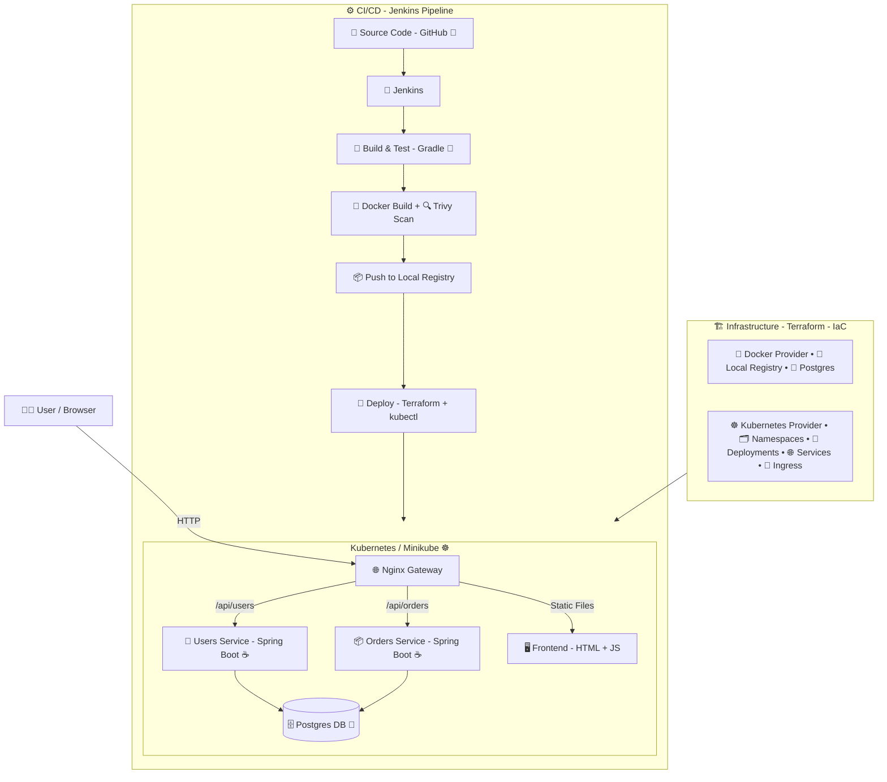

# 🏗️ System Architecture — DevOps Microservices Project

This document describes the high-level architecture of the microservices-based system.

```mermaid
graph TD
    A[🧑‍💻 User / Browser] -->|HTTP| B[🌐 Nginx Gateway]

    subgraph Cluster[Kubernetes / Minikube ☸️]
        B -->|/api/users| C[👤 Users Service - Spring Boot ☕]
        B -->|/api/orders| D[📦 Orders Service - Spring Boot ☕]
        B -->|Static Files| E[🖥️ Frontend - HTML + JS]
        C --> F[(🗄️ Postgres DB 🐘)]
        D --> F
    end

    subgraph CI_CD[⚙️ CI/CD - Jenkins Pipeline]
        G[💾 Source Code - GitHub 🐙] --> H[🤖 Jenkins]
        H --> I[🧪 Build & Test - Gradle 🧱]
        I --> J[🐳 Docker Build + 🔍 Trivy Scan]
        J --> K[📦 Push to Local Registry]
        K --> L[🚀 Deploy - Terraform + kubectl]
        L --> Cluster
    end

    subgraph Infra[🏗️ Infrastructure - Terraform - IaC]
        M[🐋 Docker Provider • 🧰 Local Registry • 🐘 Postgres]
        N[☸️ Kubernetes Provider • 🗂️ Namespaces • 🧩 Deployments • 🌐 Services • 🚪 Ingress]
    end

    Infra --> Cluster
```
